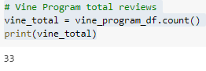
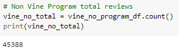
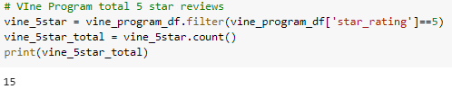
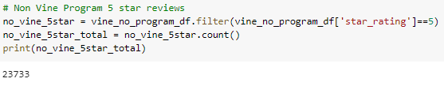
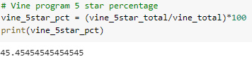
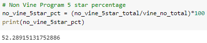

# Amazon_Vine_Analysis
Using PySpark to do analysis on 5 star Amazon reviews from the Vine Program for apparel

## Overview of the Analysis
The purpose of this analysis was to determine of there was any bias towards reviews that were written as part of the Vine program. To do this, we figured out the percentage of how many reviews that were 5 stars from both the Vine Program and not the Vine program.

## Results
#### Total Vine Reviews
There were 33 total reviews from the Vine Program.

#### Total non-Vine Reviews
There were 45,388 total non-Vine reviews.

#### Total Vine 5 Star Reviews
There were 15 total 5 star reviews from the Vine Program.

#### Total non-Vine 5 Star Reviews
There were 23,733 tot 5 star non-Vine reviews.

#### Percentage of Vine 5 Star Reviews
45.45% of the total reviews in the Vine Program were 5 stars.

#### Percentage of non-Vine 5 Star Reviews
52.29% of the total non-Vine reveiws were 5 stars.

## Summary
As we can see, there is no evidence of positivity bias for reviews of apparel in the Vine Program since the 5 star percentage is lower in the Vine Program. Another analysis we could do for this is to find the average review in both programs. For example, just because the 5 star percentage is lower in the Vine Program, that does not necessarily mean that the average review is lower.
